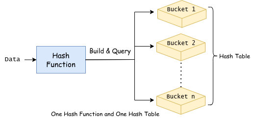

# LSH 算法

## 项目背景

LSH (Locality Sensitive Hashing) 是一种高效的向量索引算法，简单来说：在诸多表示中，快速选择出和查询表示最为接近的几个。

学习表示和快速召回有很大的应用场景。之前 A 研究院找到我们，图像表示他们已经学好了，需要帮他们解决快速召回的问题。后来遇到的 B 公司的声纹比对，需要学习好的声纹表示。由于公司数据和业务不太允许外流，这里也就不多说了。

后来参加了[电商搜索召回](https://github.com/muyuuuu/E-commerce-Search-Recall)的比赛，自己的算出来的数据总算能外流了。以 MRR@10 为评价指标，天池召回的结果是 0.3，我实现的 LSH 召回结果是 0.25，结果比较稳定。

## 数据

`data/out` 是程序执行的输出日志。`data/base` 是全部语料库的表示，`\t` 分割，第一项为项目的编号，因为这样容易统计召回结果。`data/query` 是要查询的表示。由于数据集太大不想提交上来，每个文件只有 5 行，请替换为自己的数据集。

## 算法实现

    

学 LSH 的时候遇到一些问题，没有一篇博客说人话，直到看了代码才发现这么简单。但参考的程序写的实在不太好，有些错误，我做了一些修改与多线程加速。为了避免重复构建和方便部署，把一些参数写到了配置文件：

`modules/config` 文件每一行的含义：

1. 哈希表的数量
2. 哈希函数的数量
3. 每张输入的查询结果
4. base 文件的路径
5. query 文件的路径
6. out 文件的路径
7. 1 表示读取哈希表和哈希函数，之后跟读取路径；0 表示不读取而是重新构建哈希表
8. 1 表示存储哈希表和哈希函数，之后跟存储路径；0 表示不存储

# 算法优化

- [x] 算法相关：读取配置文件确定哈希参数，避免改动代码造成的重新编译
- [x] 业务相关：保存哈希函数、哈希表
- [x] 业务相关：读取哈希函数、哈希表，直接查询
- [x] 算法相关：优化性能，从文件哈希时，空间换时间，取消每次重复的读文件，哈希时间从 5000 秒降低至 8 秒，数据规模为 1w, 2048 维
- [x] 算法相关：多线程（[线程池](https://github.com/mtrebi/thread-pool)）实现建立哈希表、多表构建与查询，性能提升与线程数有关。参考的线程池写的有 bug，我提出了 [pull request](https://github.com/mtrebi/thread-pool/pull/40)，建议用我的。**多线程处理时一定注意全局变量与锁的粒度，前者会导致出错，后者会影响性能**。

# 参考

- [多线程参考](https://github.com/mtrebi/thread-pool)
- [LSH算法参考](https://github.com/cchatzis/Nearest-Neighbour-LSH)
